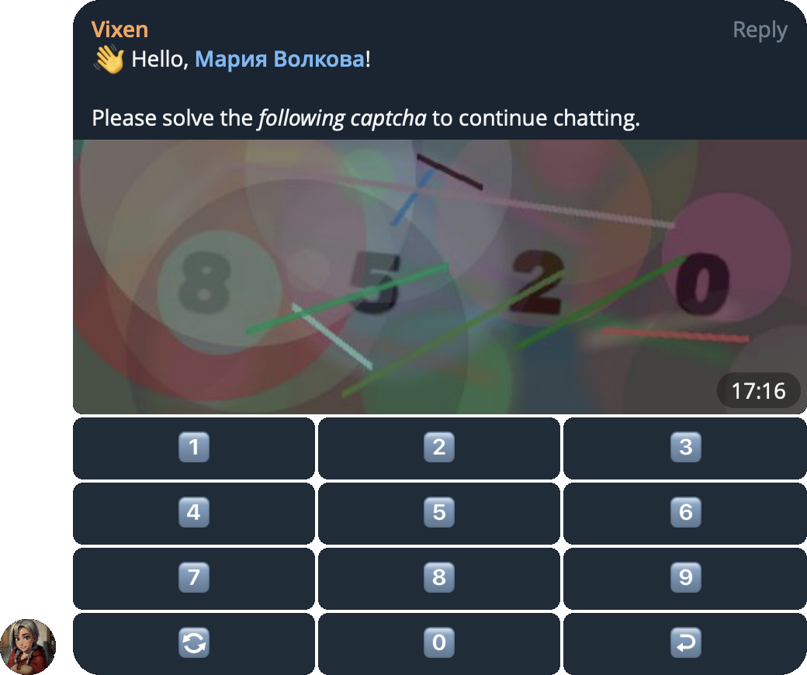

# Vixen

**Dart CAPTCHA Bot** is a security-focused bot written in Dart that helps prevent spam in Telegram groups
by generating and sending CAPTCHA challenges to new users with a virtual keyboard.
It automatically deletes initial messages from unverified users and supports multiple blocking modes.

## Features

- **CAPTCHA Verification**: Requires new users to complete a CAPTCHA before they can send messages.
- **Blocking Modes**: Supports different verification and restriction mechanisms.
- **Admin API**: Provides an API for managing bot settings and operations.
- **SQLite Storage**: Stores persistent data in an SQLite database.
- **Group-Specific Monitoring**: Watches only designated groups.
- **Metrics Support**: Tracks bot performance and user activity.
- **Flexible Configuration**: Configurable via command-line arguments, `.env` file, or environment variables.



## Configuration

```shell
Telegram Vixen Bot

-h, --help                                 Print this usage information
-t, --token=<123:ABC-DEF> (mandatory)      Telegram bot token
-c, --chats=<123,-456,-789> (mandatory)    Comma-separated list of chat IDs
-s, --secret=<1234567890>                  Secret admin API key
-d, --database=<data/vixen.db>             Path to the SQLite database file
                                           (defaults to "data/vixen.db")
-a, --address=<0.0.0.0>                    Address to bind the server to
                                           (defaults to "0.0.0.0")
-p, --port=<8080>                          Port to bind the server to
                                           (defaults to "8080")
-v, --verbose=<info>                       Verbose mode for output: all | debug | info | warn | error
                                           (defaults to "warn")
```

## How to run

Get dependencies:

```shell
dart pub get
```

Code generation:

```shell
dart run build_runner build --delete-conflicting-outputs
```

Create environment file and fill it with your credentials:

```shell
cp .env.example .env
```

Run the program:

```shell
dart run bin/vixen.dart --help
```

## How to build

```shell
dart pub get
dart run build_runner build --delete-conflicting-outputs
dart compile exe bin/vixen.dart -o vixen.run
```

## How to Docker

```shell
docker build -t vixen:latest .
docker compose up
```
