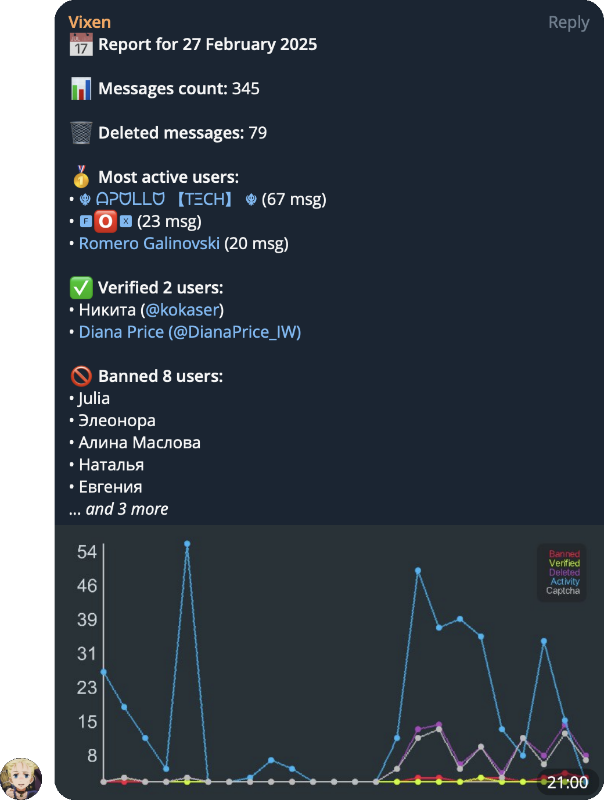

# Telegram Vixen Bot

[](https://github.com/PlugFox/vixen/actions)
[](https://github.com/PlugFox/vixen/actions)
[](https://hub.docker.com/r/plugfox/vixen)
[](https://opensource.org/licenses/MIT)

**Telegram Vixen Bot** is a bot for automatically banning spammers in Telegram chats.
Written in Dart that helps prevent spam in Telegram groups
by generating and sending CAPTCHA challenges to new users with a virtual keyboard.
It automatically deletes initial messages from unverified users and supports multiple blocking modes.

## ✨ Features

- **CAPTCHA Verification**: Requires new users to complete a CAPTCHA before they can send messages.
- **Blocking Modes**: Supports different verification and restriction mechanisms.
- **Admin API**: Provides an API for managing bot settings and operations.
- **SQLite Storage**: Stores persistent data in an SQLite database.
- **Group-Specific Monitoring**: Watches only designated groups.
- **Metrics Support**: Tracks bot performance and user activity.
- **Flexible Configuration**: Configurable via command-line arguments, `.env` file, or environment variables.
- **Cross-Platform**: Runs on Windows, macOS, and Linux, Docker. AMD64 and ARM64 architectures are supported.
- **Combot Anti-Spam**: Checks messages with Combot Anti-Spam API.
- **Reports**: Sends reports about activity in the chat.
- **Summary**: Sends a summary of the chat activity for the last 24 hours.
- **Clown Reactions**: Reacts to messages with a clown emoji.
- **Open-Source**: Available under the MIT License.




## 🛡️ Manages the following chats

- [\[RU\] Dart & Flutter](https://t.me/ru_dart)
- [Dart и Flutter](https://t.me/learn_flutter)
- [Flutter Architecture](https://t.me/flutter_architecture)

## 🚀 Getting Started

The bot supports configuration via command-line arguments, environment variables, or a `.env` file.

### 💻 Minimum System Requirements

To run the Telegram Vixen Bot, ensure your system meets the following minimum requirements:

- **Operating System**: Windows, macOS, or a recent Linux distribution
- **Processor**: x86_64 or ARM64
- **Memory**: 128 MB RAM
- **Storage**: 100 MB available space
- **Docker**: (Optional) For running the bot in a containerized environment

### 🔧 Install Dependencies

Ensure you have [Dart SDK](https://dart.dev/get-dart) installed. Then, run:

```sh
dart pub get
dart run build_runner build --delete-conflicting-outputs
```

### ▶ Run the Bot

You can start the bot using command-line arguments:

```sh
dart run bin/vixen.dart --token=123:ABC-DEF --chats=123,-456,-789 --secret=1234567890
```

Or set the configuration using environment variables:

```sh
export CONFIG_TOKEN="123:ABC-DEF"
export CONFIG_CHATS="123,-456,-789"
export CONFIG_SECRET="1234567890"
dart run bin/vixen.dart
```

Alternatively, create a `.env` file:

```sh
echo "token=123:ABC-DEF" > .env
echo "chats=123,-456,-789" >> .env
echo "secret=1234567890" >> .env
```

Then, start the bot:

```sh
dart run bin/vixen.dart
```

## ⚙️ Configuration

| Argument         | Environment           | Description                               | Default         |
| ---------------- | --------------------- | ----------------------------------------- | --------------- |
| `-t` `--token`   | `CONFIG_TOKEN`        | **(Required)** Telegram bot token         | —               |
| `-c` `--chats`   | `CONFIG_CHATS`        | Comma-separated list of chat IDs          | —               |
| `-s` `--secret`  | `CONFIG_SECRET`       | Secret admin API key                      | —               |
| `-d` `--db`      | `CONFIG_DB`           | Path to the SQLite database file          | `data/vixen.db` |
| `-a` `--address` | `CONFIG_ADDRESS`      | Address to bind the server to             | `0.0.0.0`       |
| `-p` `--port`    | `CONFIG_PORT`         | Port to bind the server to                | `8080`          |
| `-v` `--verbose` | `CONFIG_VERBOSE`      | Logs: `all`/`debug`/`info`/`warn`/`error` | `warn`          |
| `--offset`       | `CONFIG_OFFSET`       | Offset for Telegram updates               | -               |
| `--cas`          | `CONFIG_CAS`          | Check messages with Combot Anti-Spam      | `on`            |
| `--report-hour`  | `CONFIG_REPORT-HOUR`  | The hour to send daily report             | `17`            |
| `--openai-key`   | `CONFIG_OPENAI-KEY`   | OpenAI API key for summarization          | —               |
| `--openai-url`   | `CONFIG_OPENAI-URL`   | OpenAI API endpoint                       | —               |
| `--openai-model` | `CONFIG_OPENAI-MODEL` | OpenAI model                              | `gpt-4o-mini`   |
| `--clown`        | `CONFIG_CLOWN`        | Chance of clown reaction                  | `0`             |

To see all available options, run:

```sh
dart run bin/vixen.dart --help
```

## 🏗️ Building

### 🛠️ How to compile

```sh
dart pub get
dart run build_runner build --delete-conflicting-outputs
dart compile exe bin/vixen.dart -o vixen.run
```

### 🐋 How to Docker

```sh
docker build -t vixen:latest .
docker compose up
```

## 📝 Contributers

- [Mike Matiunin aka Plague Fox](https://plugfox.dev)

## 🤝 Funding

If you want to support the development of our library, there are several ways you can do it:

- [Buy me a coffee](https://www.buymeacoffee.com/plugfox)
- [Support on Patreon](https://www.patreon.com/plugfox)
- [Subscribe through Boosty](https://boosty.to/plugfox)

We appreciate any form of support, whether it's a financial donation or just a star on GitHub. It helps us to continue developing and improving our library. Thank you for your support!

## 📜 License

This project is licensed under [The MIT License](https://opensource.org/licenses/MIT).
